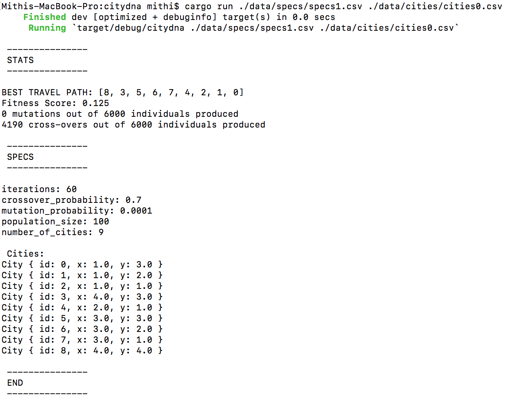
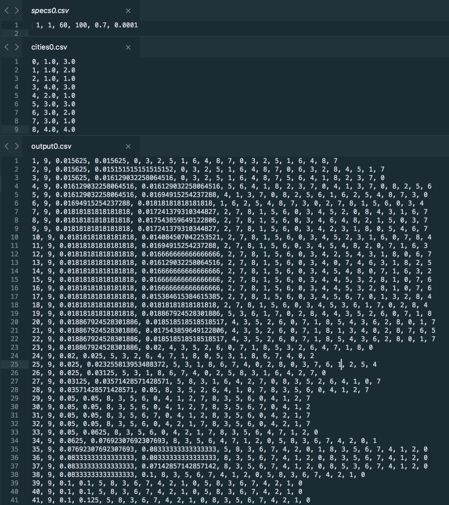

# Setup
```bash
$ cargo test -- --nocapture
$ cargo build
$ cargo run ./data/specs/specs1.csv ./data/cities/cities0.csv
```



# Simulation
```bash
$ cargo run ./specs.csv ./cities.csv > ./output.csv
$ cargo run ./data/specs/specsABC.csv ./data/cities/citiesA.csv > ./NEW_OUTPUT.csv

# ------------
# ./specs.csv
# ------------
debug_level, skip, iterations, population_size, crossover_probability, mutation_probability

where:
- debug_level: 0, 1, 2, 3 or 4
- skip: row in csv file will be written when iteration % skip == 0, should be unsigned integer >= 1
- iterations: unsigned integer
- population_size: should be an even integer and divisible by ten
- crossover_probability: between 0.0 and 1.0
- mutation_probability: between 0.0 and 1.0

# ------------
# ./cities.csv
# ------------
id1, x1, y1
id2, x2, y2
# --- snip ---
idn, xn, yn

# ------------
# ./output.csv
# ------------
iteration_step, number_of_cities, champion_fitness, challenger_fitness, champion_dna, challenger_dna
# --- snip ---

```

# City Generation and Algorithm Visualization
- **IMPORTANT**: When running the simulation: use `debug_level = 1` to generate output `csv` file compatible with the helper scripts that you can use for algorithm visualization.
- City generation scripts and algorithm visualization scripts can be found [`../scripts`](../scripts/)


# Sample Data
- Check the [`./data/`](./data/) directory for sample `csv` files used directly with the python scripts
- `csv` files in [`./data/output/`](./data/output/) directory used in the notebooks were generated by running the simulation (see section above)
- `csv` files in [`./data/cities/`](./data/cities/) directory are mostly generated with scripts in [`../scripts/`](../scripts/)



# Miscellaneous
- sample codes in [`../docs`](../docs) directory
- Known issues and future features in [`../docs/TODO.md`](../docs/TODO.md)


